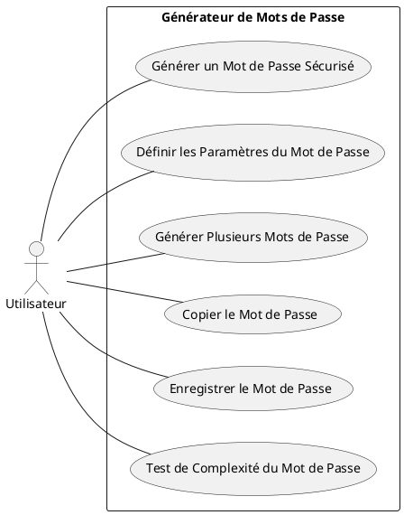

# Diagramme de cas d'utilisation

[Cours d'UML, chapitre 2](https://laurent-audibert.developpez.com/Cours-UML/?page=diagramme-cas-utilisation#L2)

## Différence entre une user story et un cas d'utilisation ?

Une _user story_ et un _cas d'utilisation_ sont deux techniques utilisées dans le développement logiciel pour comprendre
les besoins des utilisateurs. Cependant, ils diffèrent par leur niveau de détail, leur format et leur utilisation.

### User story

Une _user story_ est une technique utilisée dans le développement Agile pour capturer de manière succincte une exigence
logicielle à partir de la perspective de l'utilisateur final. Typiquement, une _user story_ a un format concis : "En
tant
que [utilisateur], je veux [tâche] afin que [bénéfice]". Par exemple : "En tant que client, je veux être en mesure de
filtrer les produits par catégorie afin que je puisse plus facilement trouver ce que je cherche".

- Plus axé sur la conversation et la compréhension des besoins des utilisateurs.
- Plus léger et moins formel.
- Fournit un niveau d'abstraction plus élevé.
- Peut manquer de détails techniques.

### Cas d'utilisation

Un cas d'utilisation est une technique plus traditionnelle pour capturer les exigences logicielles. Il décrit en détail
comment un système doit se comporter en réponse à une interaction spécifique de l'utilisateur ou dans une situation
spécifique. Par exemple, un cas d'utilisation pourrait décrire toutes les étapes que l'utilisateur doit suivre pour
effectuer un paiement en ligne.

- Plus formel et détaillé.
- Fournit une vue complète de toutes les interactions possibles avec le système.
- Inclut les acteurs, les scénarios possibles, les conditions préalables et postérieures, et les déclencheurs.
- Peut être trop lourd pour certains projets.

En somme, les _user stories_ sont généralement plus adaptées au développement Agile rapide, tandis que les cas
d'utilisation sont plus adaptés aux méthodologies de développement plus formelles et détaillées. L'utilisation de l'une
ou de l'autre dépend de l'approche de développement, des préférences de l'équipe et de la complexité du projet.

### Exemple

**_User story_ :**

```
En tant qu'Utilisateur de la bibliothèque, 
Je veux pouvoir rechercher des livres par titre, 
Afin de trouver rapidement le livre que je cherche.
```

Cette _user story_ fournit une vue de haut niveau de la fonctionnalité souhaitée de l'utilisateur, sans entrer dans les
détails de la façon dont cette fonctionnalité sera mise en œuvre.

**Cas d'utilisation :**

```
Titre : Recherche de livres par titre

Acteurs : Utilisateur de la bibliothèque, Système

Précondition : L'utilisateur est authentifié dans le système.

Déroulement :
1. L'Utilisateur entre dans la section "Recherche de livres".
2. Le Système affiche un champ de recherche.
3. L'Utilisateur entre le titre du livre dans le champ de recherche.
4. Le Système affiche une liste de livres correspondant au titre recherché.

Postcondition : Une liste de livres correspondant au titre recherché est affichée à l'utilisateur.

Exception : Si aucun livre ne correspond au titre recherché, le système affiche un message indiquant "Aucun livre trouvé".
```

Ce cas d'utilisation détaille plus explicitement le comportement attendu du système et l'interaction de l'utilisateur
avec celui-ci. Il capture également une condition exceptionnelle à gérer.

## Correspondance entre les user stories et les cas d'utilisation

Il n'y a pas nécessairement de correspondance 1 à 1 entre les user stories et les cas d'utilisation. En fait, ils
servent des objectifs légèrement différents dans le processus de développement de logiciels.

Un cas d'utilisation est une description détaillée d'une tâche spécifique que l'utilisateur peut accomplir avec le
système. Il se focalise sur comment une fonctionnalité particulière sera utilisée pour accomplir un objectif spécifié.

D'autre part, une user story est une description succincte d'une fonctionnalité du point de vue d'un utilisateur final.
Elle se focalise sur pourquoi une fonctionnalité donnée est précieuse pour l'utilisateur.

Par conséquent, un cas d'utilisation peut inclure plusieurs user stories. Par exemple, un cas d'utilisation _"Effectuer
un achat"_ peut inclure plusieurs user stories comme _"Ajouter des articles à un panier"_, _"Entrer les détails de
livraison"_, _"Effectuer un paiement"_, etc.

Cependant, dans certains scénarios, il peut y avoir une correspondance 1 à 1 entre les user stories et les cas
d'utilisation, mais cela dépend entièrement de la complexité du système et du niveau de détail de la description des
fonctionnalités.

## Diagrammes de cas d'utilisation

Un diagramme de cas d'utilisation est un type de diagramme comportemental UML (Unified Modeling Language) qui illustre
comment un système va être utilisé.

Il détaille les interactions entre le système (représenté par le diagramme) et ses acteurs (les utilisateurs ou autres
systèmes) dans le cadre d'un processus. Il met en évidence les différents chemins que les utilisateurs peuvent emprunter
lors de l'utilisation d'un système.

Chaque cas d'utilisation représente une fonctionnalité ou un processus spécifique du système. C'est une séquence
d'actions, comprenant des variantes, que le système peut effectuer en interagissant avec les acteurs.

Dans un diagramme de cas d'utilisation, les acteurs sont généralement placés à l'extérieur du diagramme, tandis que le
système lui-même est représenté par une boîte. Les cas d'utilisation sont représentés à l'intérieur de cette boîte, et
les interactions entre les acteurs et le système sont représentées par des lignes reliant les acteurs aux cas
d'utilisation correspondants.

### Exemple : générateur de mots de passe

Voici quelques exemples de cas d'utilisation pour un générateur de mots de passe :

1. **Générer un mot de passe sécurisé**
    - Acteur : Utilisateur
    - Description : L'utilisateur demande la génération d'un mot de passe sécurisé. Le système génère et affiche le mot
      de passe.

2. **Définir les paramètres du mot de passe**
    - Acteur : Utilisateur
    - Description : L'utilisateur définit des paramètres de mot de passe, tels que la longueur, l'inclusion de chiffres,
      de caractères spéciaux, de majuscules, etc. Le système enregistre ces paramètres et les utilise pour générer des
      mots de passe.

3. **Générer plusieurs mots de passe**
    - Acteur : Utilisateur
    - Description : L'utilisateur demande la génération de plusieurs mots de passe. Le système génère et affiche la
      liste des mots de passe.

4. **Copier le mot de passe**
    - Acteur : Utilisateur
    - Description : L'utilisateur souhaite copier le mot de passe généré pour l'utiliser ailleurs. Le système fournit
      une option de copie qui permet à l'utilisateur de copier le mot de passe dans le presse-papiers.

5. **Enregistrer le mot de passe**
    - Acteur : Utilisateur
    - Description : L'utilisateur veut enregistrer le mot de passe généré pour une utilisation future. Le système
      fournit une fonction permettant à l'utilisateur d'enregistrer le mot de passe dans une base de données sécurisée.

6. **Test de complexité du mot de passe**
    - Acteur : Utilisateur
    - Description : L'utilisateur souhaite tester la complexité du mot de passe généré. Le système fournit une analyser
      de complexité qui donne un score basé sur la complexité du mot de passe.

Évidemment, ces cas d'utilisation peuvent varier en fonction des fonctionnalités spécifiques de votre générateur de mots
de passe.

#### Diagramme

