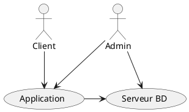

# Diagramme de contexte

Un diagramme de contexte est un outil important de la modélisation de systèmes qui fournit **une vue de haut niveau de
l'interaction entre un système et son environnement externe**. Il est souvent utilisé dans le cadre de l'analyse des
exigences dans le processus de développement logiciel.

Le diagramme de contexte montre spécifiquement :

- Le **système considéré** (généralement représenté par un cercle ou une boîte au centre du diagramme).
- Les **acteurs externes** (qui peuvent être des personnes, des systèmes ou d'autres entités) qui interagissent avec le
  système. Ces acteurs sont généralement représentés comme des boîtes ou des cercles à l'extérieur du système.
- Les **interactions** ou les **canaux de communication** entre le système et les acteurs extérieurs. Ces interactions
  sont souvent représentées par des flèches ou des lignes qui montrent la direction du flux d'information ou des
  interactions.

L'**objectif** du diagramme de contexte est de **simplifier la compréhension du système** en le représentant de manière
schématique et de porter une attention particulière aux interactions entre le système et son environnement externe. Il
aide à comprendre les limites du système et comment il s'intègre dans un contexte plus large.

C'est un outil particulièrement utile pour les analystes de systèmes et les gestionnaires de projet pour comprendre et
représenter les relations entre un système et ses acteurs externes.

## Exemple

