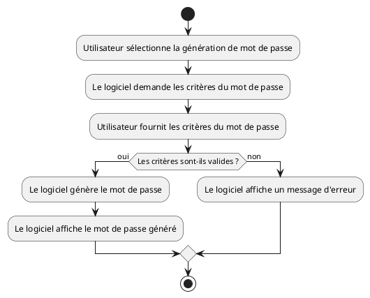
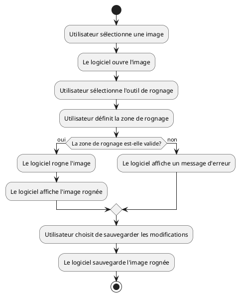
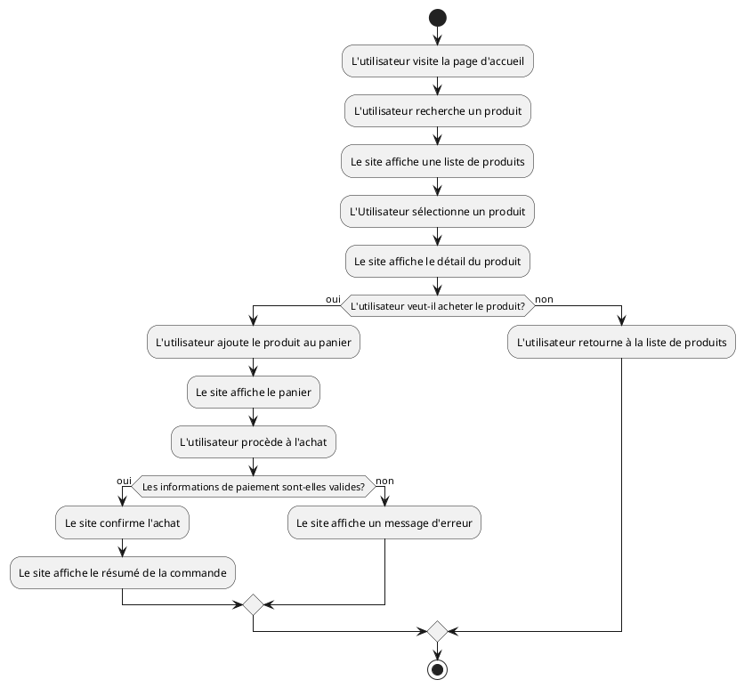

# Diagrammes d&apos;activités

Un diagramme d'activités UML est un type de **diagramme comportemental** qui visualise le workflow d'activités parmi les
composants d'un système. Il illustre le déroulement d'une opération et montre comment l'opération est séparée en actions
qui se produisent en parallèle ou en série. Le diagramme sert à modéliser le contrôle du flux dans un système en mettant
l'accent sur la séquence et les conditions d'exécution.

Vous pouvez utiliser un diagramme d'activités UML lorsque vous voulez :

1. Modéliser le flux de contrôle d'un système.
2. Capturez les processus d'affaires et les flux de travail.
3. Visualisez les étapes d'une opération ou d'un processus.
4. Analysez les opérations existantes et trouvez des moyens d'améliorer ces opérations.
5. Représenter des algorithmes graphiquement

Voici comment vous pouvez créer un diagramme d'activités UML :

1. **Définition des activités** : Commencez par identifier toutes les tâches ou activités qui seront effectuées dans la
   procédure que vous modélisez.

2. **Séquence des activités** : Après avoir identifié les activités, il faut déterminer leur ordre d'exécution.

3. **Ajout des flèches de contrôle de flux** : Des flèches sont ajoutées entre les activités pour montrer la direction
   dans laquelle l'opération se déplace.

4. **Ajout des diamants de décision** : Ajoutez un diamant chaque fois que le chemin du flux de contrôle peut bifurquer
   en fonction d'une décision.

5. **Examen et mise à jour** : Une fois le diagramme initial créé, il faut le revoir et le mettre à jour pour s'assurer
   qu'il représente avec précision le processus.

Notez que les diagrammes d'activités UML sont particulièrement utiles pour les systèmes de logiciels, mais ils peuvent
également être utilisés pour comprendre les processus d'affaires et d'autres systèmes non-logiciels.

## Exemple 1 : Génération de mots de passe

## Exemple 2 : Rogner une image

## Exemple 3 : Achat d'un produit sur un site web

## Références

1. [Cours d'UML Chapitre 6](https://laurent-audibert.developpez.com/Cours-UML/?page=diagramme-activites)
2. [PlantUML](https://plantuml.com/en/activity-diagram-beta)

