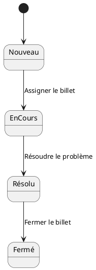
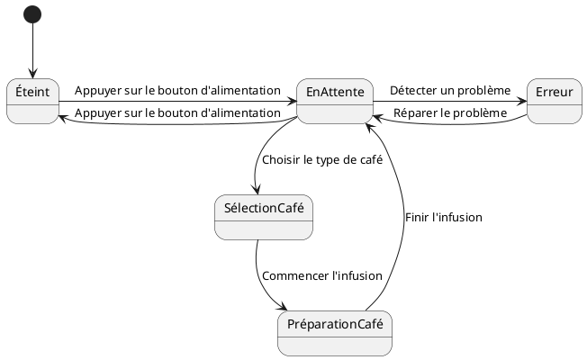

# Diagrammes d'état

Un diagramme d'état, également connu sous le nom de diagramme d'état-transition, est un type de diagramme comportemental
dans la modélisation orientée objet. Il montre le cycle de vie d'un objet et comment l'état de l'objet change en réponse
à des événements internes ou externes.

Le diagramme d'état est composé de :

- **Les États** : Ils représentent les conditions distinctes dans le cycle de vie d'un objet. Un objet change d'état en
  réponse à un événement.

- **Les Transitions** : Elles représentent le passage d'un état à un autre. Elles sont déclenchées par des événements et
  indiquent un changement d'état.

- **Les Événements** : Ce sont des occurrences spécifiques qui déclenchent des transitions. Ils peuvent être initiés par
  des acteurs externes ou par des conditions internes ou temporelles.

Les diagrammes d'état sont très utiles lors de la conception d'un logiciel pour comprendre le comportement complexe d'un
objet particulier, où l'objet peut être dans l'un des nombreux états et pourrait changer d'état en réponse à un nombre
de signaux ou d'événements différents. Les événements ne sont pas toujours représentés dans les diagrammes d'état.

## Exemple 1 : le cycle de vie d'un billet dans un système de suivi des problèmes

- Les états : _Nouveau_, _En cours_, _Résolu_, _Fermé_.
- Les transitions (actions, événements) qui font passer le billet d'un état à un autre, par exemple : _Assigner le
  billet_, _Résoudre le problème_, _Fermer le billet_.

## Exemple 2 : logiciel pour une machine à café.

- Les états pourraient être : _Éteint_, _En attente_, _Sélection du café_ _Préparation du café_, _Erreur_.
- Les événements pourraient être : _Appuyer sur le bouton d'alimentation_, _Choisir le type de café_, _Commencer
  l'infusion_, _Finir l'infusion_, _Détecter un problème_, _Réparer le problème_.

## Différences entre les diagrammes d'activités et les diagrammes d'états

Assistant:
Les diagrammes d'activités et les diagrammes d'états sont tous deux des types de diagrammes de comportement utilisés en
UML (Unified Modeling Language). Cependant, ils ont des utilisations et des focales légèrement différentes.

1. **Diagramme d'état (State Diagram)**
    - Un diagramme d'état est utilisé pour représenter le comportement d'une seule entité (classe, composant,
      sous-système, etc.).
    - Il décrit les différentes états d'une entité et comment elle transite d'un état à un autre en réponse à des
      événements.
    - Les diagrammes d'état sont davantage axés sur l'état interne d'une entité et sur la manière dont la modification
      de cet état provoque des changements de comportement pour cette entité. Par exemple, le diagramme d'état d'une
      machine à café peut comprendre des états comme "éteint", "en attente", "préparation du café", etc.

2. **Diagramme d'activité (Activity Diagram)**
    - Un diagramme d'activité est utilisé pour modéliser le flux de travail ou le processus d'affaires pour plusieurs
      entités.
    - Il décrit l'ordre séquentiel des actions et les conditions qui dictent le flux entre ces actions.
    - Les diagrammes d'activité ont une vision globale et se concentrent sur le flux de contrôle et d'objet à travers la
      modélisation des activités passées de l'état initial à l'état final. Par exemple, le diagramme d'activité d'un
      système de commande peut inclure des activités comme "sélectionner des articles", "ajouter au panier", "vérifier",
      etc.

Dans l'ensemble, les diagrammes d'activité ont une portée plus large, tandis que les diagrammes d'état sont plus
concentrés sur un seul objet ou une seule entité.

## Références

[Cours d'UML](https://laurent-audibert.developpez.com/Cours-UML/?page=diagramme-etats-transitions)
[PlantUML](https://plantuml.com/en/state-diagram)