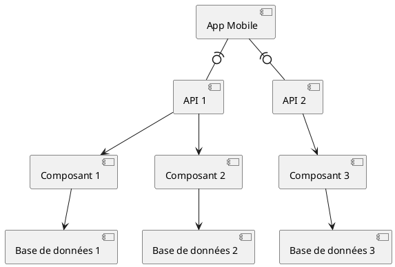

# Diagrammes de composants

Un diagramme de composants est un type de diagramme UML (Unified Modeling Language) qui est utilisé pour visualiser
l'organisation et les dépendances entre différents composants dans un système. Il fournit une représentation graphique
de haut niveau des composants, interfaces et la façon dont ils sont reliés dans un système.

Chaque composant représente une encapsulation indépendante de responsabilité fonctionnelle telle qu'une classe, une
interface ou un autre sous-système. Ces composants sont reliés entre eux en utilisant des relations de dépendances
binaires qui montrent comment ils coopèrent pour fournir des fonctionnalités au système dans son ensemble.

Le diagramme de composants est généralement utilisé dans le développement de logiciels pour décomposer de grands
systèmes en morceaux plus gérables, et pour aider à la planification de la mise en œuvre des systèmes complexes. Il peut
également être utilisé pour illustrer l'architecture d'un système existant.

## Exemple

[Autres exemples](https://creately.com/blog/software-teams/component-diagram-tutorial/)

## Références

1. [Cours d'UML Chapitre 8](https://laurent-audibert.developpez.com/Cours-UML/?page=diagrammes-composants-deploiement)
2. [PlantUML](https://plantuml.com/en/component-diagram)