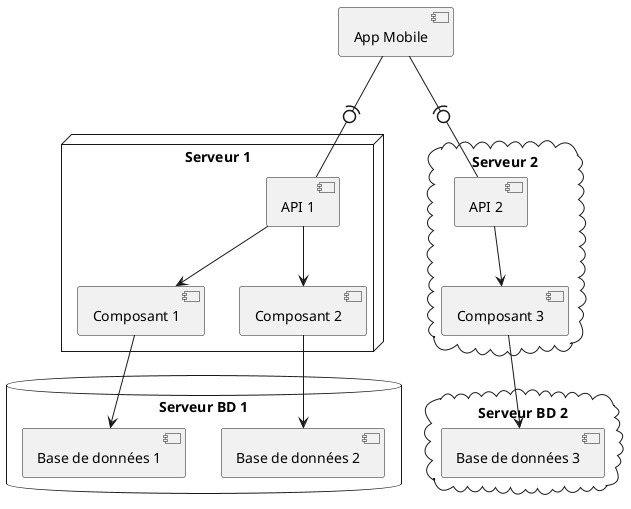

# Diagrammes de déploiement

Un diagramme de déploiement est un type de diagramme utilisé en UML qui décrit
**l'architecture du matériel** utilisé dans les systèmes et la façon dont **les éléments logiciels sont assignés à ces
parties matérielles**. C'est fondamentalement une représentation graphique de la configuration physique et de la
distribution du logiciel dans un système.

Dans un diagramme de déploiement, les éléments matériels (comme les serveurs, les machines, les nœuds, les dispositifs,
etc.) sont représentés sous forme de nœuds. Les composants du logiciel sont ensuite mappés à ces nœuds pour indiquer où
ils sont déployés et exécutés.

Par exemple, un diagramme de déploiement pour une application web pourrait montrer comment l'application est répartie
entre un serveur web, un serveur d'application et un serveur de base de données. Il peut également montrer la manière
dont ces serveurs sont connectés au réseau et comment ils communiquent entre eux.

Il permet aux architectes et aux développeurs d'avoir une image claire de la manière dont le système sera physiquement
déployé et de la façon dont les différents composants du logiciel interagiront entre eux sur cette infrastructure
matérielle.

## Exemple

[Autres exemples](https://creately.com/blog/software-teams/deployment-diagram-templates/)

## Références

1. [Cours d'UML Chapitre 8](https://laurent-audibert.developpez.com/Cours-UML/?page=diagrammes-composants-deploiement)
2. [PlantUML](https://plantuml.com/en/deployment-diagram)