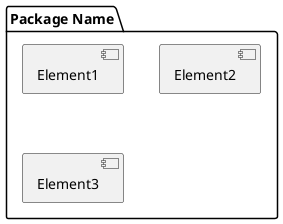
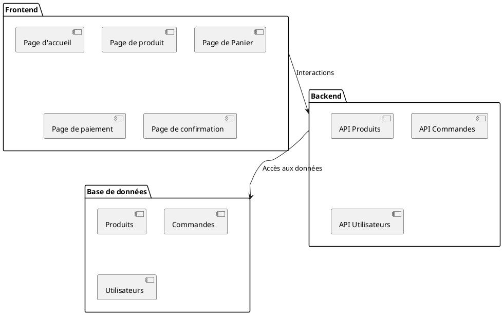

# Diagrammes de package

Un diagramme de package UML est une sorte de diagramme structurel utilisé pour représenter les packages ou les espaces
de noms. Ces packages regroupent des éléments UML similaires tels que des classes, des diagrammes, des cas
d'utilisation, des activités, etc.

Ces diagrammes sont utilisés pour diviser un logiciel complexe en plusieurs paquets gérables, ce qui facilite sa
compréhension, son développement et sa maintenance. Chaque paquet peut être développé indépendamment puis assemblé pour
créer un logiciel complet. Les packages peuvent également être réutilisés dans différents projets.

Utiliser un diagramme de package peut aider à :

1. Organiser un modèle UML en regroupant des éléments structurels liés.
2. Réduire la complexité en cachant les détails inutiles.
3. Réutiliser des artefacts UML en intégrant des packages préexistants dans un nouveau modèle.
4. Modéliser des dépendances entre différents éléments.

Exemple de structure d'un diagramme de package :

## Exemple : Site web de commerce en ligne

Cet exemple de diagramme de package UML divise le projet en trois parties principales : _Frontend_, _Backend_ et 
_Base de données_.

Le package _Frontend_ comprend différentes pages que les utilisateurs peuvent visualiser et avec lesquelles ils peuvent
interagir.

Le package _Backend_ contient les API ou services nécessaires pour interagir avec la Base de données.

Le package _Base de données_ comprend les différentes tables ou collections de données requises pour le projet.

