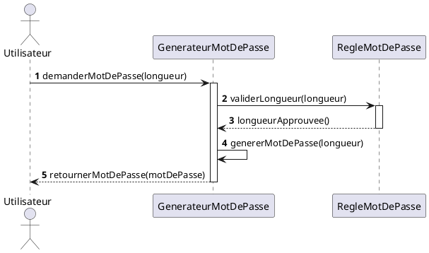
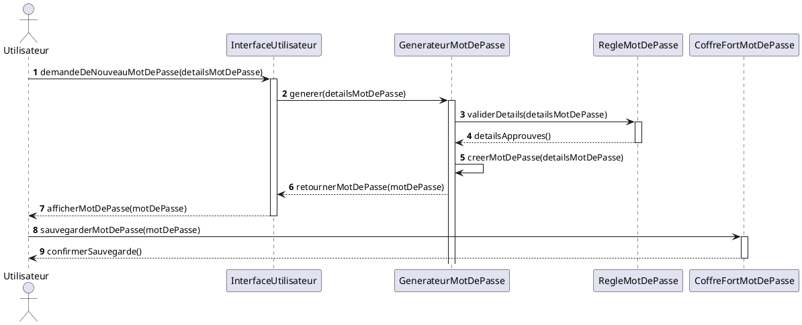

# Diagrammes de séquences

Un diagramme de séquences, parfois appelé un diagramme de messages, est un type de diagramme utilisé en ingénierie
logicielle dans le cadre de la modélisation orientée objet. Faisant partie du langage de modélisation unifié (UML), le
diagramme de séquences est utilisé pour visualiser et documenter les interactions entre les objets dans un système au
cours d'un processus ou d'une période de temps spécifiée.

Voici quelques principaux éléments qui composent un diagramme de séquences :

- **Lignes de vie** : Chaque ligne de vie représente un objet ou un acteur dans le processus. C'est généralement une
  instance d'une classe.

- **Barres d'activation** : Une barre d'activation sur une ligne de vie indique qu'un objet participe à une interaction.

- **Messages** : Les messages, représentés par des flèches entre les lignes de vie, indiquent une interaction ou une
  communication entre les objets. L'ordre de ces messages est indiqué de haut en bas.

- **Retours** : Ces flèches représentent la réponse d'une interaction.

Un diagramme de séquences est très utile pour comprendre comment les différents éléments d'un système interagissent pour
accomplir une tâche spécifique, l'ordre dans lequel ces interactions se produisent, et comment les objets se passent
l'information (et dans quelle séquence).

## Exemple : Génération de mots de passe

### Version courte

Dans cet exemple, l'utilisateur déclenche le processus en demandant un mot de passe d'une certaine longueur
au générateur de mots de passe (_GenerateurMotDePasse_). Le générateur de mots de passe valide alors la longueur
demandée avec une règle de mots de passe (_RegleMotDePasse_) avant de générer le mot de passe et de le renvoyer à
l'utilisateur.

Remarquez que le diagramme de séquence met en évidence l'ordre des interactions et qui initie chaque action. Par
exemple, c'est l'utilisateur qui déclenche le processus, et le générateur de mots de passe qui initie la validation de
la longueur.

### Version longue

## Références

1. [Cours d'UML Chapitre 7](https://laurent-audibert.developpez.com/Cours-UML/?page=diagrammes-interaction#L7-3)
2. [PlantUML](https://plantuml.com/en/sequence-diagram)