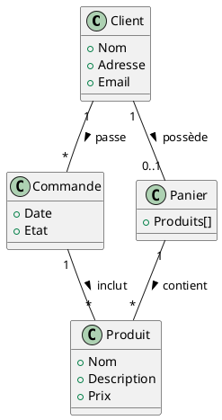

# Diagrammes du domaine

Un diagramme de domaine UML, aussi connu sous le nom de _modèle de domaine_, de _diagramme de classe conceptuelle_ ou
_diagramme d'analyse orientée objet_, représente le vocabulaire et les concepts clés pertinents pour un domaine
spécifique. Il sert principalement à modéliser les concepts de haut niveau dans le domaine du problème et leurs
relations. Contrairement aux diagrammes de classes techniques, il ne décrit pas comment le système est implémenté.

Un diagramme de domaine UML englobe généralement les éléments suivants :

- **Classes de domaine** : Ces classes représentent des concepts clés dans le domaine du problème. Par exemple, dans le
  domaine du commerce électronique, nous pourrions avoir des classes de domaine comme "Produit", "Client", "Commande",
  etc.

- **Associations** : Les associations sont des liens qui connectent les classes de domaine et illustrent la nature de
  leur relation. Par exemple, une relation "identifiée par" peut exister entre la classe "Client" et la classe "
  IdentifiantClient".

- **Attributs** : Les attributs sont des propriétés définies dans les classes qui décrivent les caractéristiques des
  concepts du domaine. Par exemple, la classe "Produit" pourrait avoir des attributs comme "nom", "prix", "description",
  etc.

Les diagrammes de domaine sont très utiles tout au long du processus de développement de logiciel, pour comprendre les
requis de haut niveau, pour communiquer avec les parties prenantes non techniques, et comme base pour des modèles plus
détaillés comme les diagrammes de classes.

## Exemple : Site web de commerce en ligne

### Lien entre un diagramme de domaine et un diagramme entité-association

Un diagramme de domaine UML et un diagramme Entité-Association (EA) sont deux outils de modélisation de données qui
visent à représenter les données et leurs relations d'une manière conceptuelle et abstraite. Ces deux types de
diagrammes sont utilisés pour analyser et définir les besoins en termes de stockage et de manipulation des données pour
un système. Cependant, ils diffèrent par plusieurs aspects :

- **Focus** : Un diagramme de domaine UML se concentre sur les "objets" du monde réel (ou les concepts du domaine),
  indépendamment de la manière dont ils sont stockés ou gérés par le système. Par contre, un diagramme EA se concentre
  sur les "entités" qui doivent être stockées en tant que données, ainsi que sur leur structure et leurs relations.

- **Associations** : Dans un diagramme de domaine UML, les associations entre les classes représentent des liens
  conceptuels et logiques entre les objets du monde réel. Dans un diagramme EA, les relations représentent comment les
  différentes entités sont liées dans la base de données.

- **Utilisation** : Les diagrammes de domaine UML sont souvent utilisés lors de la phase de conception initiale du
  projet pour aider à comprendre les besoins et les concepts du domaine du problème. Les diagrammes EA, quant à eux,
  sont principalement utilisés lors de la conception et de la modélisation de bases de données. Lors de la conception
  d'un système ayant une base de données en son centre, il est possible de développer un diagramme entité-association
  avant les diagrammes de domaine et les diagrammes de classe.

En résumé, un diagramme de domaine UML est généralement plus abstrait et orienté vers l'utilisateur, tandis qu'un
diagramme EA est plus technique et orienté vers la conception de bases de données. Les deux types de diagrammes peuvent
se compléter dans un projet de développement de logiciel.

