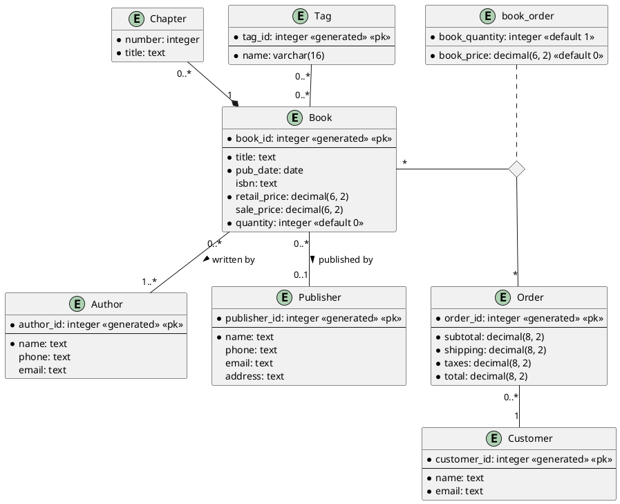
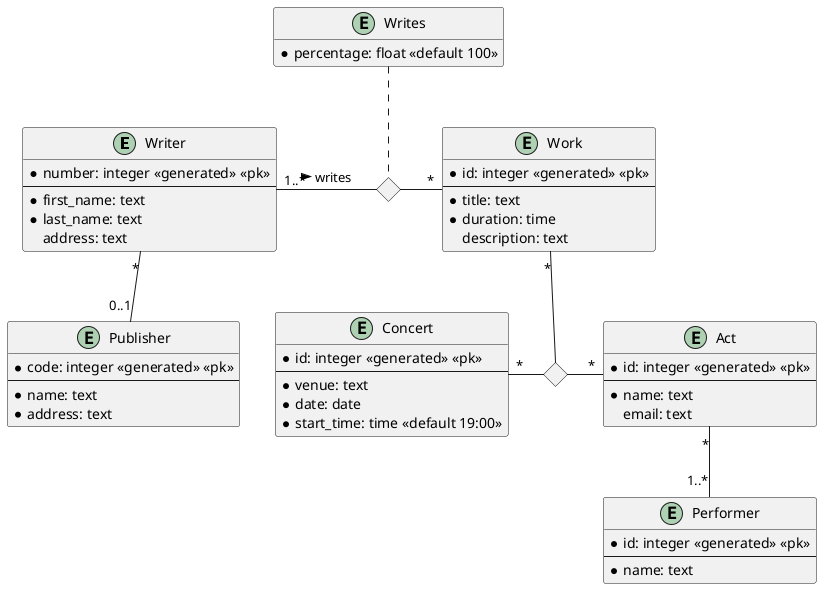

# Diagrammes entité-association

## Exemple 1 : Livres

```plantuml
@startuml

hide empty methods

entity Book {
    * book_id: integer <<generated>> <<pk>>
    --
    * title: text
    * pub_date: date
    isbn: text
    * retail_price: decimal(6, 2)
    sale_price: decimal(6, 2)
    * quantity: integer <<default 0>>
}

entity Author {
    * author_id: integer <<generated>> <<pk>>
    --
    * name: text
    phone: text
    email: text
}

entity Publisher {
    * publisher_id: integer <<generated>> <<pk>>
    --
    * name: text
    phone: text
    email: text
    address: text
}

entity Chapter {
    * number: integer
    * title: text
}

entity Tag {
    * tag_id: integer <<generated>> <<pk>>
    --
    * name: varchar(16)
}

Book "0..*" -- "1..*" Author: written by >

Book "0..*" -- "0..1" Publisher: published by >

Chapter "0..*" --* "1" Book

Tag "0..*" -- "0..*" Book

entity Customer {
    * customer_id: integer <<generated>> <<pk>>
    --
    * name: text
    * email: text
}

entity Order {
    * order_id: integer <<generated>> <<pk>>
    --
    * subtotal: decimal(8, 2)
    * shipping: decimal(8, 2)
    * taxes: decimal(8, 2)
    * total: decimal(8, 2)
}

entity book_order {
    * book_price: decimal(6, 2) <<default 0>>
    * book_quantity: integer <<default 1>>
}

Order "0..*" -- "1" Customer 
<> book_order_diamond
Book "*" - book_order_diamond
book_order_diamond -- "*" Order

book_order .. book_order_diamond

@enduml
```

## Exemple 2 : Musique

```plantuml
@startuml

hide empty methods

entity Writer {
    * number: integer <<generated>> <<pk>>
    --
    * first_name: text
    * last_name: text
    address: text
}

entity Publisher {
    * code: integer <<generated>> <<pk>>
    --
    * name: text
    * address: text
}

entity Work {
    * id: integer <<generated>> <<pk>>
    --
    * title: text
    * duration: time
    description: text
}

entity Writes {
    * percentage: float <<default 100>>
}

entity Act {
    * id: integer <<generated>> <<pk>>
    --
    * name: text
    email: text
}

entity Concert {
    * id: integer <<generated>> <<pk>>
    --
    * venue: text
    * date: date
    * start_time: time <<default 19:00>>
}

entity Performer {
    * id: integer <<generated>> <<pk>>
    --
    * name: text
}

Writer "*" -- "0..1" Publisher

<> writes_diamond
Writer "1..*" - writes_diamond: writes > 
writes_diamond - "   *" Work
Writes .. writes_diamond

<> performed_diamond
Work "*" -- performed_diamond
performed_diamond - "*" Act
Concert "*" - performed_diamond

Act "*" -- "1..*" Performer
@enduml
```