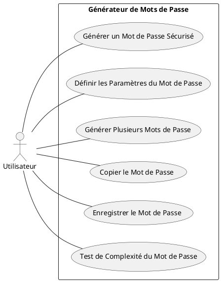
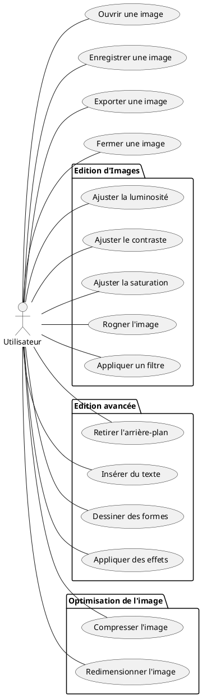

# Exemples

## Générateur de mots de passe

### Diagramme {id="diagramme_1"}

### Cas d'utilisation (version courte)  {id="cas-d-utilisation-version-courte_1"}

1. **Générer un mot de passe sécurisé**
    - Acteur : Utilisateur
    - Description : L'utilisateur demande la génération d'un mot de passe sécurisé. Le système génère et affiche le mot
      de passe.

2. **Définir les paramètres du mot de passe**
    - Acteur : Utilisateur
    - Description : L'utilisateur définit des paramètres de mot de passe, tels que la longueur, l'inclusion de chiffres,
      de caractères spéciaux, de majuscules, etc. Le système enregistre ces paramètres et les utilise pour générer des
      mots de passe.

3. **Générer plusieurs mots de passe**
    - Acteur : Utilisateur
    - Description : L'utilisateur demande la génération de plusieurs mots de passe. Le système génère et affiche la
      liste des mots de passe.

4. **Copier le mot de passe**
    - Acteur : Utilisateur
    - Description : L'utilisateur souhaite copier le mot de passe généré pour l'utiliser ailleurs. Le système fournit
      une option de copie qui permet à l'utilisateur de copier le mot de passe dans le presse-papiers.

5. **Enregistrer le mot de passe**
    - Acteur : Utilisateur
    - Description : L'utilisateur veut enregistrer le mot de passe généré pour une utilisation future. Le système
      fournit une fonction permettant à l'utilisateur d'enregistrer le mot de passe dans une base de données sécurisée.

6. **Test de complexité du mot de passe**
    - Acteur : Utilisateur
    - Description : L'utilisateur souhaite tester la complexité du mot de passe généré. Le système fournit une analyse
      de complexité qui donne un score basé sur la complexité du mot de passe.

Évidemment, ces cas d'utilisation peuvent varier en fonction des fonctionnalités spécifiques de votre générateur de mots
de passe.

## Logiciel de manipulation d'images

### Diagramme {id="diagramme_2"}

### Cas d'utilisation (version courte) {id="cas-d-utilisation-version-courte_2"}

1. **Ouvrir une image**
    - Acteur : Utilisateur
    - L'utilisateur peut sélectionner et ouvrir une image existante dans le logiciel pour la manipuler. Les formats
      d'images supportés dépendront du logiciel spécifique.

2. **Enregistrer une image**
    - Acteur : Utilisateur
    - Suite à des modifications sur une image, l'utilisateur a la possibilité d'enregistrer ces changements. Cette
      action mettra à jour l'image originale avec les modifications réalisées.

3. **Exporter une image**
    - Acteur : Utilisateur
    - L'utilisateur peut choisir d'exporter l'image modifiée. Cela permet d'enregistrer les modifications apportées sans
      altérer l'image originale. L'image peut être exportée sous un nouveau nom de fichier ou dans un format différent.

4. **Fermer une image**
    - Acteur : Utilisateur
    - L'utilisateur peut fermer l'image qu'il a ouverte dans le logiciel. Cette action ne quitte pas le programme,
      seulement la visualisation et la manipulation de l’image actuelle.

5. **Ajuster la luminosité**
    - Acteur : Utilisateur
    - L'utilisateur peut modifier la luminosité de l'image en utilisant les outils appropriés du logiciel, pour la
      rendre plus claire ou plus sombre.

6. **Ajuster le contraste**
    - Acteur : Utilisateur
    - L'utilisateur a la possibilité d’augmenter ou de diminuer le contraste de l'image, améliorant ainsi la distinction
      entre les zones d’ombres et de lumière.

7. **Ajuster la saturation**
    - Acteur : Utilisateur
    - L’utilisateur peut augmenter ou diminuer la saturation pour intensifier ou atténuer les couleurs.

8. **Rogner l'image**
    - Acteur : Utilisateur
    - L'utilisateur peut couper une partie de l'image pour enlever des zones indésirables ou changer la taille de
      l'image.

9. **Appliquer un filtre**
    - Acteur : Utilisateur
    - Divers filtres peuvent être appliqués par l'utilisateur pour modifier l'apparence générale de l'image, tels que
      des filtres vintage, noir et blanc, sépia, etc.

10. **Retirer l'arrière-plan**
    - Acteur : Utilisateur
    - Dans certains cas, l'utilisateur peut avoir besoin de supprimer l'arrière-plan de l'image. Certains logiciels
      offrent des outils dédiés pour cette tâche.

11. **Insérer du texte**
    - Acteur : Utilisateur
    - L'utilisateur peut ajouter du texte à l'image, le personnaliser en changeant la police, la couleur, la taille,
      l’orientation, etc.

12. **Dessiner des formes**
    - Acteur : Utilisateur
    - L'utilisateur peut dessiner différentes formes (cercles, carrés, lignes, etc.) sur l'image.

13. **Appliquer des effets**
    - Acteur : Utilisateur
    - L'utilisateur peut appliquer divers effets spéciaux à l'image pour lui donner un aspect créatif ou artistique.

14. **Compresser l'image**
    - Acteur : Utilisateur
    - Pour réduire la taille du fichier de l'image pour un stockage ou un partage plus facile, l'utilisateur peut
      utiliser une fonction de compression.

15. **Redimensionner l'image**
    - Acteur : Utilisateur
    - L'utilisateur peut changer la largeur et la hauteur de l'image selon ses besoins.

### Cas d'utilisation (version longue)

1. **Cas d'utilisation : Ouvrir une image**
    - **Objectif** : Charger une image dans le logiciel pour effectuer des manipulations ultérieures.
    - **Acteur(s)** : Utilisateur
    - **Préconditions** : Le logiciel est ouvert et l'image à ouvrir est disponible sur le dispositif de stockage
    - **Scénario** : L'utilisateur navigue vers le dossier contenant l'image, sélectionne le fichier d'image et lance l'
      opération d'ouverture.
    - **Postconditions** : L'image est chargée dans le logiciel et prête pour des manipulations.

2. **Cas d'utilisation : Enregistrer une image**
    - **Objectif** : Sauvegarder les modifications effectuées sur l'image.
    - **Acteur(s)** : Utilisateur
    - **Préconditions** : Une image a été ouverte et modifiée dans le logiciel.
    - **Scénario** : Après avoir réalisé des modifications sur l'image, l'utilisateur lance l'opération de sauvegarde.
    - **Postconditions** : Les modifications de l'image sont enregistrées et le fichier d'image original est mis à jour.

3. **Cas d'utilisation : Exporter une image**
    - **Objectif** : Sauvegarder l'image modifiée dans un nouveau fichier ou un format différent, en conservant
      l'original intact.
    - **Acteur(s)** : Utilisateur
    - **Préconditions** : Une image a été ouverte et modifiée dans le logiciel.
    - **Scénario** : L'utilisateur choisit l'option d'exportation, sélectionne le format de l'image et le répertoire de
      sauvegarde, puis lance l'opération d'exportation.
    - **Postconditions** : L'image modifiée est enregistrée sous un nouveau nom de fichier ou dans un nouveau format,
      l'image originale restant inchangée.

4. **Cas d'utilisation : Fermer une image**
    - **Objectif** : Fermer l'image actuellement ouverte dans le logiciel.
    - **Acteur(s)** : Utilisateur
    - **Préconditions** : Une image est actuellement ouverte dans le logiciel.
    - **Scénario** : L'utilisateur choisit l'option pour fermer l'image.
    - **Postconditions** : L'image est fermée, libérant ainsi les ressources utilisées.

5. **Cas d'utilisation : Ajuster la luminosité**
    - **Objectif** : Modifier la luminosité de l'image pour améliorer sa qualité visuelle.
    - **Acteur(s)** : Utilisateur
    - **Préconditions** : Une image est ouverte dans le logiciel pour l'édition.
    - **Scénario** : L'utilisateur utilise l'option d'ajustement de la luminosité, sélectionne le niveau souhaité de
      luminosité et applique le changement.
    - **Postconditions** : La luminosité de l'image est modifiée en fonction des ajustements de l'utilisateur.

6. **Cas d'utilisation : Ajuster le contraste**
    - **Objectif** : Modifier le contraste de l'image pour améliorer sa qualité visuelle.
    - **Acteur(s)** : Utilisateur
    - **Préconditions** : Une image est ouverte dans le logiciel pour l'édition.
    - **Scénario** : L'utilisateur utilise l'option d'ajustement du contraste, sélectionne le niveau souhaité de
      contraste et applique le changement.
    - **Postconditions** : Le contraste de l'image est modifié en fonction des ajustements de l'utilisateur.

7. **Cas d'utilisation : Ajuster la saturation**
    - **Objectif** : Modifier la saturation de l'image pour améliorer sa qualité visuelle ou créer un effet spécifique.
    - **Acteur(s)** : Utilisateur
    - **Préconditions** : Une image est ouverte dans le logiciel pour l'édition.
    - **Scénario** : L'utilisateur utilise l'option d'ajustement de la saturation, sélectionne le niveau souhaité de
      saturation et applique le changement.
    - **Postconditions** : La saturation de l'image est modifiée en fonction des ajustements de l'utilisateur.

8. **Cas d'utilisation : Rogner l'image**
    - **Objectif** : Extraire une partie souhaitee de l'image ou supprimer les parties indésirables.
    - **Acteur(s)** : Utilisateur
    - **Préconditions** : Une image est ouverte dans le logiciel pour l'édition.
    - **Scénario** : L'utilisateur sélectionne l'outil de rognage, spécifie la zone de l'image à conserver et applique
      le changement.
    - **Postconditions** : Seule la partie sélectionnée de l'image est conservée et sa taille est réduite en
      conséquence.

9. **Cas d'utilisation : Appliquer un filtre**
    - **Objectif** : Appliquer un filtre prédéfini à l'image pour créer un effet spécifique.
    - **Acteur(s)** : Utilisateur
    - **Préconditions** : Une image est ouverte dans le logiciel pour l'édition.
    - **Scénario** : L'utilisateur sélectionne l'option de filtre, choisit un filtre parmi ceux disponibles et applique
      le filtre à l'image.
    - **Postconditions** : L'image est modifiée pour refléter l'effet du filtre choisi.

10. **Cas d'utilisation : Retirer l'arrière-plan**
    - **Objectif** : Séparer le sujet de l'image de son arrière-plan.
    - **Acteur(s)** : Utilisateur
    - **Préconditions** : Une image est ouverte dans le logiciel pour l'édition.
    - **Scénario** : L'utilisateur utilise l'option de suppression de l'arrière-plan et sélectionne le sujet à
      conserver. Le logiciel supprime l'arrière-plan.
    - **Postconditions** : Seul le sujet de l'image est conservé; l'arrière-plan est supprimé.

11. **Cas d'utilisation : Insérer du texte**
    - **Objectif** : Ajouter des légendes, des titres ou d'autres textes à l'image.
    - **Acteur(s)** : Utilisateur
    - **Préconditions** : Une image est ouverte dans le logiciel pour l'édition.
    - **Scénario** : L'utilisateur sélectionne l'outil d'ajout de texte, entre le texte souhaité, le positionne sur
      l'image et applique le changement.
    - **Postconditions** : Le texte est ajouté à l'image à l'emplacement spécifié.

12. **Cas d'utilisation : Dessiner des formes**
    - **Objectif** : Ajouter des formes géométriques à l'image.
    - **Acteur(s)** : Utilisateur
    - **Préconditions** : Une image est ouverte dans le logiciel pour l'édition.
    - **Scénario** : L'utilisateur sélectionne l'outil de dessin de forme, choisit la forme souhaitée, la place sur
      l'image et applique le changement.
    - **Postconditions** : La forme est ajoutée à l'image à l'emplacement spécifié.

13. **Cas d'utilisation : Appliquer des effets**
    - **Objectif** : Appliquer des effets spéciaux à l'image.
    - **Acteur(s)** : Utilisateur
    - **Préconditions** : Une image est ouverte dans le logiciel pour l'édition.
    - **Scénario** : L'utilisateur sélectionne l'option d'effets, choisit un effet parmi ceux disponibles et applique
      l'effet à l'image.
    - **Postconditions** : L'effet choisi est appliqué à l'image, modifiant son apparence en conséquence.

14. **Cas d'utilisation : Compresser l'image**
    - **Objectif** : Réduire la taille du fichier de l'image pour économiser de l'espace de stockage ou pour faciliter
      le partage.
    - **Acteur(s)** : Utilisateur
    - **Préconditions** : Une image est ouverte dans le logiciel pour l'édition.
    - **Scénario** : L'utilisateur sélectionne l'option de compression, définit le niveau de compression souhaité et
      applique le changement.
    - **Postconditions** : La taille du fichier de l'image est réduite en fonction du niveau de compression spécifié.

15. **Cas d'utilisation : Redimensionner l'image**
    - **Objectif** : Modifier les dimensions de l'image.
    - **Acteur(s)** : Utilisateur
    - **Préconditions** : Une image est ouverte dans le logiciel pour l'édition.
    - **Scénario** : L'utilisateur sélectionne l'option de redimensionnement, entre les nouvelles dimensions souhaitées
      et applique le changement.
    - **Postconditions** : Les dimensions de l'image sont modifiées pour correspondre aux valeurs entrées par l'
      utilisateur.
