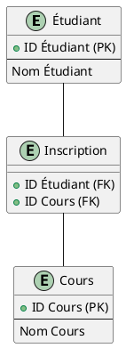
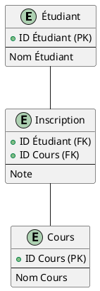
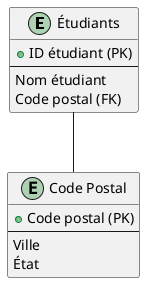

# Normalisation

La normalisation des bases de données est un processus qui organise les tables de données et leurs relations pour
réduire les redondances et améliorer l'intégrité des données. L'objectif est d'isoler les données de manière à ce
qu'elles soient conservées dans un emplacement unique et soient accessibles via un point d'intersection unique.

La normalisation se fait généralement en plusieurs étapes, appelées formes normales, chacune ayant un objectif
spécifique.

Voici les trois premières formes normales avec des exemples:

1. **Première forme normale (1NF)**:
   Les tables sont organisées de façon à éliminer les duplications de données. Chaque table doit avoir une clé primaire,
   chaque colonne doit être atomique (indivisible), et chaque enregistrement doit être unique.

   Par exemple, si vous avez une table "Étudiants" avec les colonnes "ID étudiant", "Nom étudiant", "Cours suivis", et
   si un étudiant suit plusieurs cours, ce n'est pas en 1NF car la colonne "Cours suivis" aurait plusieurs valeurs. Pour
   atteindre la 1NF, nous devons diviser "Cours suivis" en plusieurs enregistrements.

2. **Deuxième forme normale (2NF)**:
   Les tables doivent être en 1NF plus toutes les colonnes non-clés doivent être pleinement dépendantes de la clé
   primaire. En d'autres termes, elles ne doivent pas dépendre d'une partie seulement de la clé primaire (dans le cas
   des clés primaires composites).

   Si nous avons une table "Inscriptions" avec "ID étudiant", "Nom étudiant", "ID cours", "Nom du cours", "Note", la clé
   primaire est composée de "ID étudiant" et "ID cours". Cependant, "Nom étudiant" dépend seulement de "ID étudiant"
   et "Nom du cours" dépend uniquement de "ID cours", alors cette table n'est pas en 2NF. Pour atteindre la 2NF on doit
   diviser cette table en deux: "Étudiant" et "Cours".

3. **Troisième forme normale (3NF)**:
   Les tables doivent être en 2NF et toutes les colonnes doivent être directement dépendantes de la clé primaire.

   Si nous avons la table "Étudiants" avec "ID étudiant", "Nom étudiant", "Code postal", "Ville", "État". Ici, "ville"
   et "état" dépendent du "code postal", pas directement de "ID étudiant". Pour mettre cela en 3NF, on doit diviser
   cette table en deux tables "Étudiants" et "Code postal".

Il existe d'autres formes normales comme BCNF, 4NF, 5NF (ou PJ/NF), 6NF, mais les trois formes normales décrites
ci-dessus sont les plus souvent utilisées. La normalisation doit être équilibrée car une trop grande normalisation peut
entraîner une complexité excessive et une mauvaise performance.

## Exemples

### 1NF

Si on a une table "Étudiants" avec les colonnes "ID étudiant", "Nom étudiant", "Cours suivis", et si un étudiant suit
plusieurs cours, ce n'est pas en 1NF car la colonne "Cours suivis" aurait plusieurs valeurs. Pour atteindre la 1NF, nous
devons diviser "Cours suivis" en plusieurs enregistrements.

Table Étudiant :

| ID étudiant | Nom étudiant | Cours suivis    |
|-------------|--------------|-----------------|
| 1           | Alice        | Maths, Physique |
| 2           | Bob          | Maths, Anglais  |

PlantUML pour la 1NF :

### 2NF

Si on a une table "Inscriptions" avec "ID étudiant", "Nom étudiant", "ID cours", "Nom du cours", "Note", la clé
primaire est composée de "ID étudiant" et "ID cours". Cependant, "Nom étudiant" dépend seulement de "ID étudiant"
et "Nom du cours" dépend uniquement de "ID cours", alors cette table n'est pas en 2NF. Pour atteindre la 2NF on doit
diviser cette table en deux : "Étudiant" et "Cours".

Table Inscriptions :

| ID étudiant | Nom étudiant | ID cours | Nom du cours | Note |
|-------------|--------------|----------|--------------|------|
| 1           | Alice        | 101      | Maths        | A    |
| 1           | Alice        | 201      | Physique     | B    |
| 2           | Bob          | 101      | Maths        | C    |
| 2           | Bob          | 202      | Anglais      | D    |

PlantUML pour la 2NF :

### 3NF

Si nous avons la table "Étudiants" avec "ID étudiant", "Nom étudiant", "Code postal", "Ville", "État". Ici, "ville"
et "état" dépendent du "code postal", pas directement de "ID étudiant". Pour mettre cela en 3NF, on doit diviser
cette table en deux tables "Étudiants" et "Code postal".
Table "Étudiants" :

| ID étudiant | Nom étudiant | Code postal | Ville | État   |
|-------------|--------------|-------------|-------|--------|
| 1           | Alice        | 75000       | Paris | France |
| 2           | Bob          | 69000       | Lyon  | France |
| 3           | Charlie      | 75000       | Paris | France |

Dans cette situation, ni "Ville" ni "État" ne sont directement dépendants de "ID Étudiant". Ils dépendent plutôt du 
"Code postal". Pour passer à la 3NF, on crée une nouvelle table "Code postal" et on modifie la table "Étudiant" en
conséquence.

PlantUML pour la 3NF :

