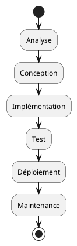

# Développement en cascade

Le développement en cascade, aussi appelé **modèle en cascade**, est l'un des modèles méthodologiques les plus
anciens et les plus compréhensibles pour le développement de logiciels. Dire qu'un processus est en cascade est une
autre façon de dire qu'il est **séquentiel**. Dans une cascade, l'eau coule pas à pas, progressivement vers le bas. De
la même manière, le processus de développement en cascade est également progressif, avançant à travers différentes
phases.

Voici les phases du développement en cascade :

**Phase d'analyse des exigences :** C'est le premier stade du processus de développement. Dans cette phase, les
développeurs communiquent avec les clients et les parties prenantes pour recueillir toutes les exigences des
utilisateurs. Ces exigences sont alors documentées de manière exhaustive pour être utilisées comme base pour les phases
suivantes du projet.

**Phase de conception :** Cette phase comprend la conception du logiciel et de son architecture. Les exigences
recueillies lors de la phase d'analyse sont utilisées pour concevoir la solution. Cela peut impliquer une conception de
haut niveau, où l'architecture générale du système est définie, ainsi qu'une conception de bas niveau, où les détails
spécifiques de chaque composant du système sont définis.

**Phase d'implémentation :** C'est dans cette phase que le code du logiciel est réellement écrit. En utilisant les
dessins et les spécifications fournies lors de la phase de conception, les développeurs écrivent le code qui donnera vie
au logiciel.

**Phase de test :** Une fois le code écrit, le logiciel entre dans la phase de test. Ceci est essentiel pour s'assurer
que le logiciel fonctionne comme prévu et qu'il est exempt de bugs. Les tests peuvent être effectués à différents
niveaux, y compris des tests unitaires, des tests d'intégration, des tests de système et des tests d'acceptation.

**Phase de déploiement :** Une fois que tout le code a été testé et que le logiciel a été accepté par les clients ou les
utilisateurs, il est prêt à être déployé. Cela signifie que le logiciel est mis en ligne et mis à la disposition des
utilisateurs.

**Phase de maintenance :** Même après le déploiement, le travail n'est pas terminé. Le logiciel peut toujours rencontrer
des problèmes ou il peut y avoir des changements dans les exigences. C'est là qu'intervient la phase de maintenance. Les
développeurs corrigent les erreurs, s'adaptent aux nouvelles exigences et s'assurent que le logiciel continue de
fonctionner comme prévu.

L'un des principaux avantages du modèle en cascade est sa simplicité. Chaque phase a un début et une fin, et le
processus progresse de manière linéaire de phase en phase. Cependant, ce modèle a des limites, notamment le fait qu'il
**ne gère pas bien les changements d'exigences après le début du processus**. Ainsi, bien qu'il puisse encore être utile
dans certains contextes, **de nombreuses équipes adoptent aujourd'hui des modèles plus flexibles et adaptatifs, tels que
l'Agile**.
