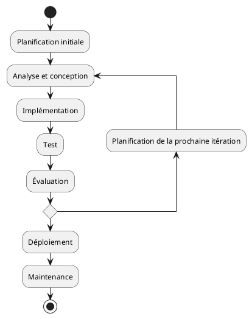

# Développement itératif et incrémental

Le développement itératif et incrémental est une méthode de développement de logiciels qui privilégie la livraison de
petits morceaux de fonctionnalités finies et testées au lieu de livrer tout le projet en une seule fois à la fin. Cette
approche est basée sur le cycle de vie du développement de logiciels qui sont itératifs (signifie que les étapes sont
répétées) et incrémentaux (signifie que chaque itération livre du travail qui ajoute aux caractéristiques précédentes).

L'approche du développement incrémental et itératif se décompose comme suit :

1. **Planification initiale :** L'étape de planification initiale comprend la détermination des besoins du système ou du produit
   et la documentation des exigences. Ces exigences sont alors décomposées en plusieurs blocs de travail ou groupes
   d'exigences.

2. **Analyse et conception :** Chaque itération du cycle de logiciel commence par une phase d'analyse des requis et de
   conception. Des exigences spécifiques ou des parties des exigences sont choisies pour cette itération et une analyse
   détaillée est effectuée. Sur la base des besoins de l'utilisateur, le système est conçu pour répondre à ces
   exigences.

3. **Implémentation :** Les développeurs de logiciels codent les exigences de la conception pour cette itération. À la
   fin de cette étape, le produit logiciel devrait avoir des fonctionnalités supplémentaires au fur et à mesure qu'il
   est développé par incréments.

4. **Test :** Les tests sont une étape importante de chaque itération. Le code est testé pour s'assurer qu'il répond aux
   exigences définies pour cette itération et qu'il s'intègre correctement avec le code précédemment développé.

5. **Évaluation et planification de la prochaine itération :** Une fois une itération terminée et que le produit a été
   testé et évalué, l'équipe planifie la prochaine itération. Ce processus comprend une évaluation de l'itération
   actuelle pour identifier les leçons apprises et comment elles pourraient être appliquées pour améliorer les futures
   itérations.

Ce cycle de développement se poursuit, chaque itération construisant sur les fonctionnalités livrées dans les itérations
précédentes, jusqu'à ce que le produit logiciel final soit complet.

L'**avantage principal de cette approche est que les risques sont minimisés**, car les problèmes peuvent être détectés
et corrigés plus tôt dans le cycle de vie. Les utilisateurs voient également le produit évoluer et peuvent fournir des
commentaires précieux dès le début du processus. Il permet également de **mieux adapter le produit aux besoins
changeants** du client ou du marché.

Cependant, **il nécessite une bonne planification et gestion** pour s'assurer que chaque itération livre des
fonctionnalités de valeur et que toutes les parties du produit fonctionnent ensemble de manière cohérente. Un
accompagnement constant et une rétroaction constructive de la part des utilisateurs sont également nécessaires pour le
succès de cette méthode.
